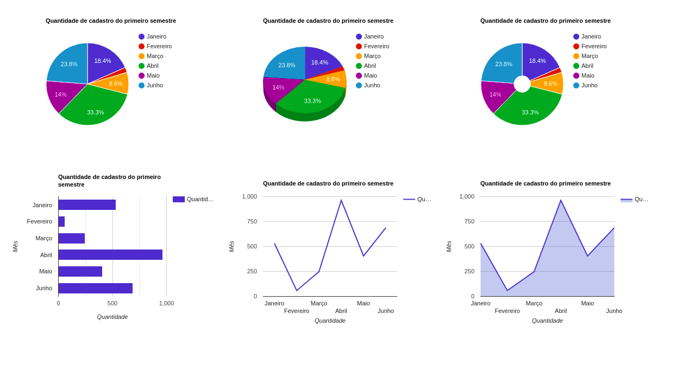

# Projeto DashBoard
* Projeto em Reactjs para treinamento, onde o projeto consiste em projetar graficos de varios tipos.

* Dentro do <b>README</b> da pasta do projeto está tudo que está sendo usando.
   * https://github.com/thiagoadssilva/udemyDashboard/blob/main/frontend/README.md

## Link para o projeto publicado
   - http://dashboard.tfcoder.com/

## <b>Tela de Inicio</b> 

